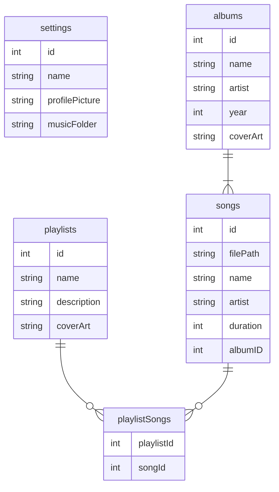

<p align="center">
  
</p>

<p align="center">
  <a href="https://github.com/hiaaryan/wora"></a>
  <a href="https://github.com/hiaaryan/wora"></a>
  <a href="LICENSE"></a>
  <a href="https://discord.gg/CrAbAYMGCe"></a>
  <a href="https://github.com/hiaaryan/wora/stargazers"></a>
  <a href="https://github.com/hiaaryan/wora/network"></a>
  <a href="https://github.com/hiaaryan/wora/watchers"></a>
</p>


## 🤝 Contributing to Wora

Thank you for considering contributing to **Wora**! 🎉 We welcome contributions from everyone. We have prepared some guidelines for you to get started ✅

## 🛠️ Project Setup

Wora is an Electron app built with Next.js and TailwindCSS, using BetterSQLite3 with Drizzle ORM for database management. Here's an overview of the database schema:



## 🎯 **How to Contribute**

Once you get hold of the DB, please check out the file structure in the main branch to get yourself more familiar with the project. If you encounter any issues, support for developers is available through our discord server 🛠️

<a href="https://discord.gg/CrAbAYMGCe"></a>

1. **Fork the Repository**

Fork the [repository](https://github.com/hiaaryan/wora) and clone it locally:

```sh
git clone https://github.com/your-username/wora.git
cd wora
```

2. **Create a New Branch**

Create a new branch for your feature or bugfix:

```sh
git checkout -b feature-branch
```

3. **Install Dependencies**

Install the required dependencies:

```sh
yarn install
```

4. **Start Development Server**

Run the development server to see your changes:

```sh
yarn dev
```

5. **Commit Your Changes**

Commit your changes with a meaningful message:

```sh
git commit -am 'Add new feature ✅'
```

6. **Push to Your Branch**

Push the changes to your branch on GitHub:

```sh
git push origin feature-branch
```

7. **Create a Pull Request**

Go to the original repository on GitHub and create a new pull request. Please also read our [Code of Conduct](CODE_OF_CONDUCT.md) to understand the expectations for behavior within our community 🙏

## 💬 Join the Community

Join our [Discord server](https://discord.gg/CrAbAYMGCe) to connect with other users and developers 🤝

<a href="https://discord.gg/CrAbAYMGCe"></a>

---

MIT License. Made with ❤️ by [hiaaryan](https://github.com/hiaaryan) and contributors.
